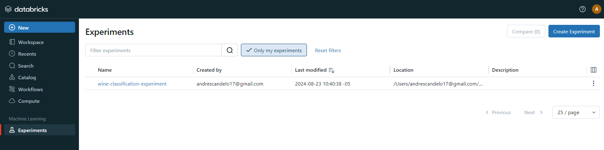
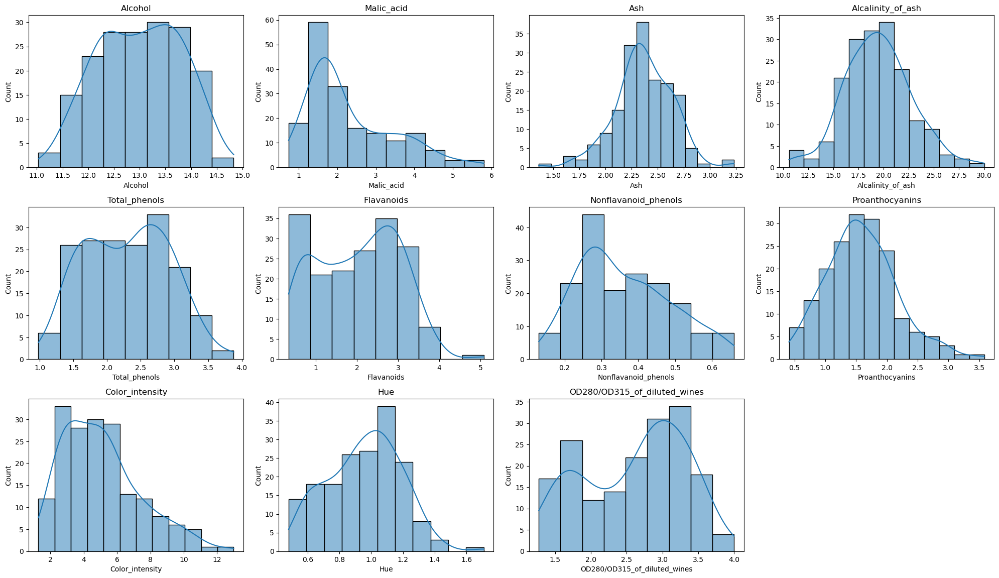
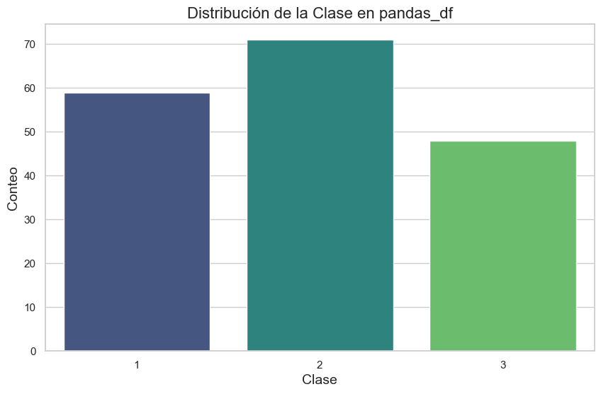
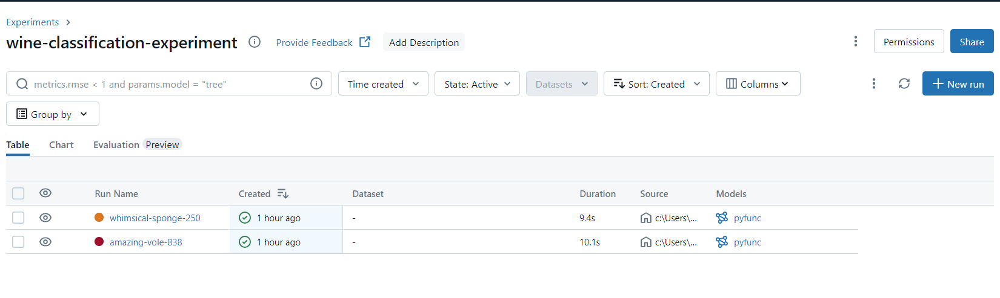
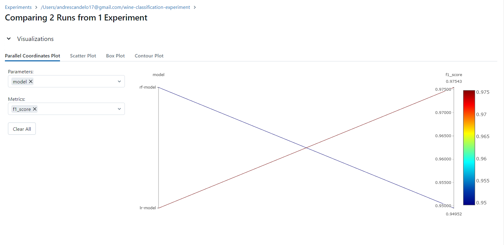

# Wine Classification with PySpark and MLflow

## Descripción

Este proyecto se enfoca en la clasificación de vinos utilizando PySpark para el procesamiento de datos y modelos de aprendizaje automático. El seguimiento y la gestión de experimentos se realiza con MLflow, lo que permite un registro detallado de los resultados obtenidos durante el proceso de entrenamiento.

## Requisitos

- Python 3.8 o superior
- PySpark
- MLflow
- Pandas
- Numpy

## Instalación

Para instalar las dependencias necesarias, puedes utilizar pip:

```bash
pip install pyspark mlflow pandas numpy
```
## Crear experientos en mlflow
```bash
import mlflow
from mlflow import spark

# Configurar el experimento en MLflow
mlflow.set_experiment('/Users/andrescandelo17@gmail.com/wine-classification-experiment')
```

## Carga de Datos y transformar los datos
Primero, los datos se cargan y preparan para el modelado. Se agrega nombres a las columnas con base en el diccionario de datos enviado
```bash
from pyspark.sql import SparkSession

# Inicializar sesión de Spark
spark = SparkSession.builder.appName("WineClassification").getOrCreate()

# Cargar datos
data = spark.read.csv("winedata.csv", header=True, inferSchema=True)


# los nombres de las columnas son
column_names = [
    "Class", "Alcohol", "Malic_acid", "Ash", "Alcalinity_of_ash", "Magnesium",
    "Total_phenols", "Flavanoids", "Nonflavanoid_phenols", "Proanthocyanins",
    "Color_intensity", "Hue", "OD280/OD315_of_diluted_wines", "Proline"
]

```
## Analisis exploratorio


Se evidencia que no hay presencia de atipicos

Distribución Normal:

Varias de las características, como Alcohol, Ash, Total_phenols, y Proanthocyanins, parecen seguir una distribución aproximadamente normal, aunque con diferentes grados de asimetría y kurtosis.

Sesgo en la Distribución:
Características como Malic_acid y Nonflavanoid_phenols muestran un sesgo a la derecha, lo que indica que la mayoría de los valores están concentrados en la parte inferior del rango.
Por otro lado, Color_intensity muestra un sesgo hacia la izquierda, con más valores concentrados en la parte superior del rango.

Densidad y Variabilidad:
Las características como Flavanoids y OD280/OD315_of_diluted_wines muestran una distribución más amplia, lo que indica una mayor variabilidad entre los valores medidos.
La característica Ash muestra una menor variabilidad con valores concentrados en un rango estrecho.

La variable objetivo se encuentra un poco desbalanceada para la clase 3.


## Entrenamiento de los Modelos
Se prueba un modelo Random Forest y una regresion logistica donde se realiza optimizacion de hiperarametros
```bash
from pyspark.sql import SparkSession
from pyspark.ml.feature import VectorAssembler
from pyspark.ml.classification import RandomForestClassifier, LogisticRegression
from pyspark.ml.tuning import CrossValidator, ParamGridBuilder
from pyspark.ml.evaluation import MulticlassClassificationEvaluator
import mlflow
import mlflow.spark


# Evaluador para F1 Score
evaluator = MulticlassClassificationEvaluator(labelCol="Class", predictionCol="prediction", metricName="f1")

# Random Forest
rf = RandomForestClassifier(labelCol="Class", featuresCol="features")
rf_param_grid = (ParamGridBuilder()
                 .addGrid(rf.numTrees, [10, 50])
                 .addGrid(rf.maxDepth, [5, 10])
                 .build())
cv_rf = CrossValidator(estimator=rf,
                       estimatorParamMaps=rf_param_grid,
                       evaluator=evaluator,
                       numFolds=5)

# Regresión Logística
lr = LogisticRegression(labelCol="Class", featuresCol="features", maxIter=10)
lr_param_grid = (ParamGridBuilder()
                 .addGrid(lr.regParam, [0.1, 0.01])
                 .addGrid(lr.elasticNetParam, [0.8, 0.5])
                 .build())
cv_lr = CrossValidator(estimator=lr,
                       estimatorParamMaps=lr_param_grid,
                       evaluator=evaluator,
                       numFolds=5)


# Ajustar modelos
cv_rf_model = cv_rf.fit(train_df)
cv_lr_model = cv_lr.fit(train_df)

# Evaluar modelos
def evaluate_model(model, test_df):
    predictions = model.transform(test_df)
    f1_score = evaluator.evaluate(predictions)
    return f1_score
```

## Seguimiento de Experimentos con MLflow
MLflow se utiliza para gestionar los experimentos, lo que permite un registro detallado de métricas, hiperparámetros y artefactos.

```bash
# Configuración del experimento
mlflow.set_experiment('/Users/andrescandelo17@gmail.com/wine-classification-experiment')

class SparkModelWrapper(mlflow.pyfunc.PythonModel):
    def load_context(self, context):
        self.model = context.artifacts['model']  # Asegúrate de cargar el modelo

    def predict(self, context, model_input):
        return self.model.transform(model_input)

def log_model_with_mlflow(model, model_name):
    # Terminar cualquier ejecución activa
    if mlflow.active_run() is not None:
        mlflow.end_run()
    
    with mlflow.start_run():
        mlflow.log_param("model", model_name)
        f1_score = evaluate_model(model, test_df)
        mlflow.log_metric("f1_score", f1_score)
        
        mlflow.pyfunc.log_model(
            artifact_path=model_name,
            python_model=SparkModelWrapper()
        )

# Registrar los modelos entrenados
log_model_with_mlflow(cv_rf_model.bestModel, "rf-model")
log_model_with_mlflow(cv_lr_model.bestModel, "lr-model")
```


Una vez se cargaron los modelos se realiza comparacion de las metricas en mlflow



## Conclusiones
El modelo que mostro mejor performance fue la regresion logistica con un f1score de 0.975430107526881
Todo el código se desarrolló en PySpark para tener una solución escalable y eficiente para el procesamiento de grandes volúmenes de datos
